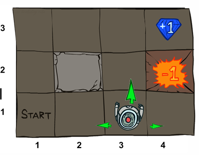
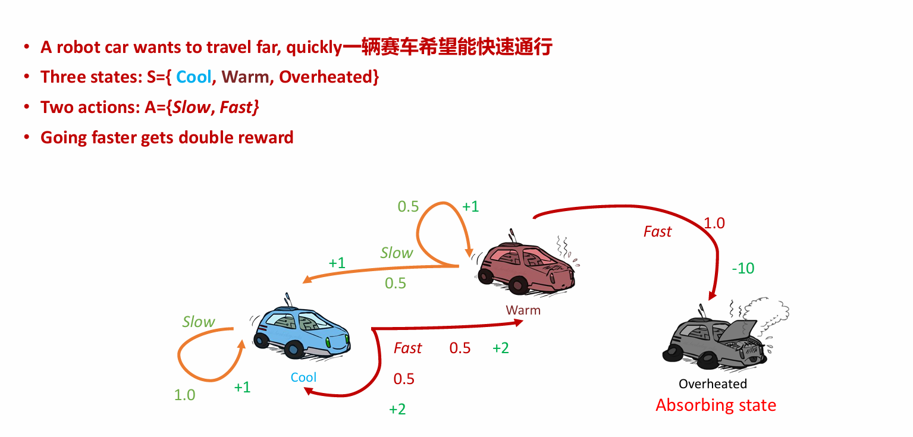
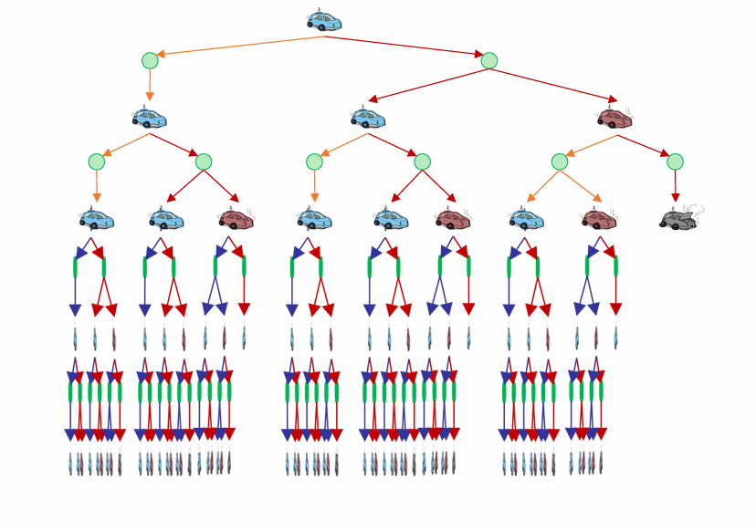
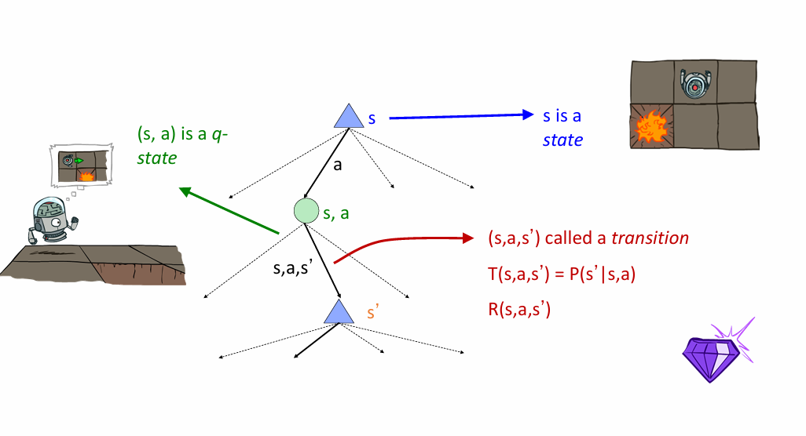
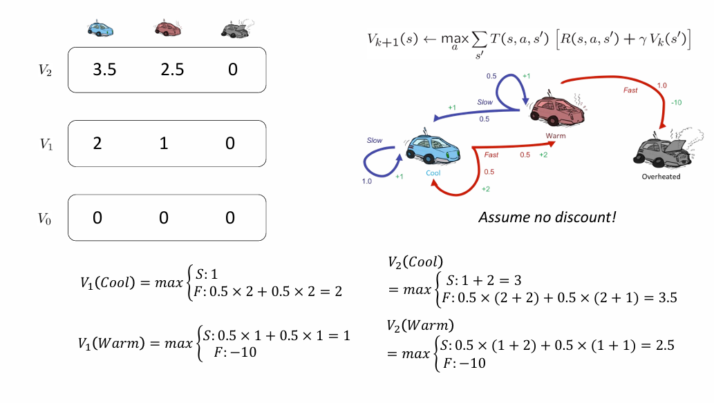
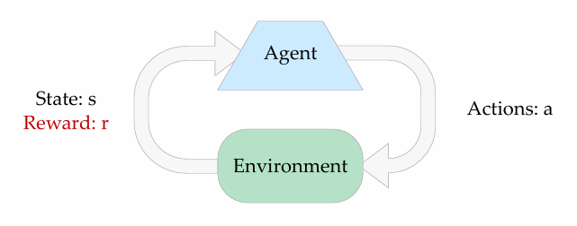

# 框架
- MDP问题: 本质是求解动态规划问题,环境不确定,转移函数已知,但转移函数已知
    - Value iteration
    - Policy iteration
- 强化学习:对环境的理解需要通过学习获得,不知道T和R
    - 探索和利用
    - MC (蒙特卡洛采样)
    - TD (差分采样)
    - Q学习
    - 深度Q学习

# Markov Decision Processes 马尔可夫决策过程

## Non-Deterministic Search 非确定性问题

!!! tip 
    ### 存在不确定性的行动:
        - 假设80%的概率,执行向北走命令
        - 10%的概率向西走,10%的概率向东走
        - 如果Agent碰到墙,则停留在原地

    ### Agent在每一步中都能获得reward(奖励)
        - 每一步都有小奖励,可以为负值
        - 大的奖励在最后出现

    ### 目标:奖励总和最大化

- 定义一个MDP需要以下参数:
    - 状态集S: $s \in S$
    - 行动集A: $a \in A$
    - 转换函数 T(s,a,s') or P(s'|s,a) 表示状态s经过行动a转移到状态s'
    - 奖励函数 R(s,a,s') s状态经过行动a转移到s'获得的奖励
    - 初始状态
    - 终端状态
- MDP是不确定性的搜索问题
- MDP quantities so far:
    - 策略Policy:每一种状态下的行动选择
    - 效用Utility:回报之和
## 马尔可夫决策过程中的"马尔可夫"有何意义?
- "马尔可夫"一般是指, 鉴于目前的状态,未来和过去是独立的
- 对于马尔可夫决策过程, "马尔可夫"意味着行动结果只取决于当前状态, 即  $P(S_{t+1}=s'|S_t=s_t,A_t=a_t,S_{t-1}=s_{t-1},A_{t-1},\dots, S_0=s_0)=P(S_{t+1}=s'|S_t=s_t,A_t=a_t)$

- 马尔可夫决策过程是“马尔可夫的”, 即满足马尔可夫性(Markov property), 或是无记忆性
(memoryless property), 意思是在已知现在状态的情况下, 过去和未来是条件独立的。

!!! note "策略"
    策略$\pi$为每一个状态提供一个行动  
    最佳策略$\pi^*$:遵循该策略, 预期效用最大化的策略
!!! note "效用函数"
    指Agent对奖励序列的偏好
!!! note "折扣因子"
    我们越早拿到奖励越好, 因此我们假设奖励会随时间的流逝而以指数形势衰减  
    折扣因子$\gamma$  
    e.g. 有一个当前奖励是1的操作, 这一次没操作, 下一次操作的奖励就变成$\gamma$,如果再下一次操作的奖励就变成$\gamma^2$
!!! question "为什么我们要折扣因子?"
    1.较早的奖励可能比较晚的奖励有更高的效用  
    2.有助于我们算法收敛

这么讲可能有点抽象,如何求解马尔科夫问题,我们来看具体问题
## 赛车问题

正如题目中所写, 一辆车希望能快速通行, 自然是速度越快, 得分越高,slow操作只能获得0.5分, 而fast操作能获得1分

!!! tip
    对于本题,我们有三种状态以及两种操作  
    $S=\{Cool, Warm, Overheated\}$  
    $A=\{Slow, Fast\}$

既然"富贵险中求",我们在加速操作之后,如果你在<strong>"Cool"</strong>状态,则有变成<strong>"Warm"</strong>的风险,如果你在<strong>"Warm"</strong>状态下还采取<strong>"fast"</strong>操作,那么你的车就<strong>"Overheated"</strong>了,给予最大程度的惩罚<del>(这是我们最不想看到的)</del>

根据图片所给信息,我们就可以得到转移函数\(T(s,a,s')\) 
<ul>
<li> \(T(cool;slow;cool)=1\)</li>
<li> \(T(warm;slow;cool)=0.5\)</li>
<li> \(T(warm;slow;warm)=0.5\)</li>
<li> \(T(cool;fast;cool)=0.5\)</li>
<li> \(T(cool;slow;warm)=0.5\)</li>
<li> \(T(warm;fast;overheated)=1\)</li>
</ul>

同时,我们也可以得到奖励函数\(R(s,a,s')\) 
<ul>
<li> \(R(cool;slow;cool)=1\)</li>
<li> \(R(warm;slow;cool)=1\)</li>
<li> \(R(warm;slow;warm)=1\)</li>
<li> \(R(cool;fast;cool)=2\)</li>
<li> \(R(cool;slow;warm)=2\)</li>
<li> \(R(warm;fast;overheated)=-10\)</li>
</ul>

接下来我们画出搜索树

!!! note "惊人的发现"
    我们的搜索树居然长得很像expetimax的搜索树！

让我们把这个搜索树抽象一下(借用一下老师PPT上的图片)

!!! note 
    s,s'代表了两种状态  
    (s,a)是q-状态;Q=(s,a),本质和机会节点一样  
    (s,a,s')是转移过程,其中转换函数 $T(s,a,s')=P(s'|s,a)$,奖励函数 $R(s,a,s')$

观察上边的搜索树,如果一直使用expetimax,我们可以发现两个问题 
1. 状态被重复太多:最左边以及中间的子树和母树其实是等价的,会导致很多重复计算 
2. 树一直在走下去,无穷无尽
!!! tip
    针对第一个问题,有一个解决办法:只计算一次需要的数量
     而针对第二个问题,我们可以限制深度,因为做到处于比较深的节点时,变化很小,后面做不做对结果没有影响
     <strong>注意:</strong>如果 $\gamma < 1$,树的深层部分最终是不重要的

观察我们抽象出来的搜索树,给出一些定义
!!! abstract
    $V^*(s)$ :从s开始并采取最佳行动的预期效用 
    $Q^*(s,a)$ :从s状态开始采取a行动后的预期效用,(此后)以最佳方式行动
    $\pi^*(s)$ : 从状态s开始的最佳行动

## 状态值的计算
<ul>
<li>最佳行动下的预期效用</li>
<li>奖励的(折现)平均总和</li>
</ul>

!!! note "价值的递归定义"
    $$
    \begin{align}
        V^*(s)=\max_{a} Q^*(s,a) \\
        Q^*(s,a)=\sum_{s'}T(s,a,s')[R(s,a,s')+\gamma V^*(s')]  \\
        V^*(s)=\max_{a} \sum_{s'}T(s,a,s')[R(s,a,s')+\gamma V^*(s')] 
    \end{align}
    $$
!!! note "Value Iteration 值迭代"
    <ul>
    <li>从 \( V_0(s)=0 \) 开始:意味着期望奖励总和为0</li>
    <li>给出\( V_k(s) \)的值,每个状态用expetimax计算: \( V_{k+1}(s)\leftarrow \max_{a}\sum_{s'}T(s,a,s')[R(s,a,s')+\gamma V_k(s')] \) </li>
    <li>重复进行,直到收敛</li>
    </ul>
    **遍历的复杂度:**$O(S^2A)$  
    **定理:**将收敛到唯一的最优值

我们将Cool, Warm, Overheated三个状态的期望奖励总和均从0开始,即 \( V_0(s)=0 \) 
根据上述的状态转移方程,我们可以计算出采取不同行动 <strong>(在这里指 Fast , Slow)</strong> 到达下一层状态所能获得的效用值\(V_1(s')\), 并取max作为最优效用值, 作为该层该状态的效用 
不断重复上述步骤,直至稳定

!!! note "Dynamic Programming Equation动态规划方程"
    <ul>
    <li>Bellman方程: 将决策问题分解为更小的子问题</li>
    <li>Bellman最优化原理: 最优化策略有这样的性质，即无论初始状态和初始决策是什么，余下的决策必定构成一个与由初始决策导致的状态有关的最优化策略。</li>
    <li>表达形式:\(V^*(s)=\max_{a}\sum_{s'}T(s,a,s')[R(s,a,s')+\gamma V^*(s')]\)</li>
    </ul>

注意看上述方程, 原本我们转移方程只是从 \(V_k\) 转移到 \(V_{k+1}\) , 而Bellman论证了我们可以从前一种状态的最优值转移得到下一个状态的最优值,即\(V^*(s) \rightarrow V^*(s')\) 
最终我们可以提取出一个最优策略 
\(\pi^*(s)=arg\max_{a}\sum_{s'}T(s,a,s')[R(s,a,s')+\gamma V^*(s')]\)

!!! warning 
    我们在值迭代的过程中可以很明显发现它的一些缺点：
    <ul>
    <li>迭代速度慢：每一次计算都要从头算起，时间复杂度高</li>
    <li>每个状态下“最大值”很少变化，有很多冗余的迭代</li>
    <li>策略往往在数值之前很长时间就收敛了，提取策略并不需要等到数值收敛再提取</li>
    </ul>

## 改进：从Q值学习
!!! note 
    我们可以根据最优Q值,确定我们的最优策略,即 $\pi^*(s)=arg\max_{a}Q^*(s,a)$  
    <strong>Q value Iteration Q值遍历:</strong> 
    <ul>
    <li>从我们已知的\(Q_0(s,a)=0\)开始</li>
    <li>我们可以从\(Q_k\)转移到\(Q_{k+1}\):\(\quad Q_{k+1}(s,a) \leftarrow \sum_{s'}T(s,a,s')[R(s,a,s')+\gamma \max_{a'}Q_k(s',a')]\)</li>
    </ul>

# Reinforcement Learning 强化学习

!!! note "Basic idea"
    <ul>
    <li>以奖励的形式接受反馈</li>
    <li>智能体的效用是由奖励函数定义的</li>
    <li>必须(学会)采取行动,以使预期回报最大化</li>
    <li>所有的学习都是基于观察到的结果样本!</li>
    </ul>

## Model-Based Learning 基于模型的学习
