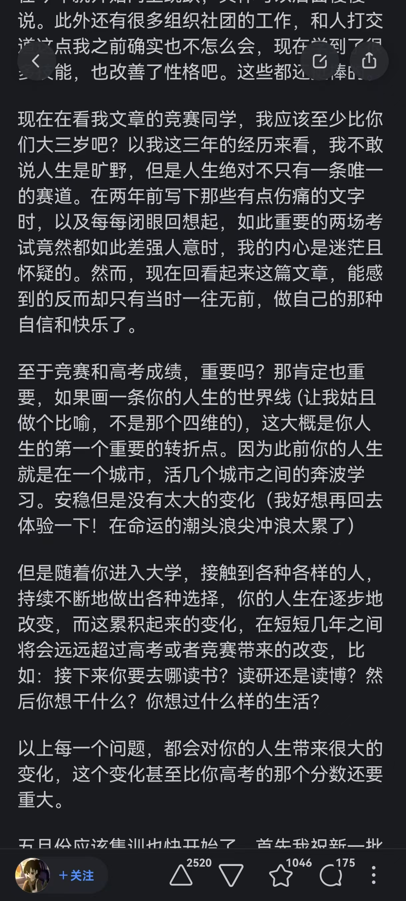

虽然离竞赛生活已经过去了几年了，但我对竞赛是充满热忱的。每当回忆起我初高中的竞赛生活，我的记忆总会回到炎热的暑期，脑海中浮现出我每天骑着车去学校机房训练的场景，清晰又模糊。清晰的是每次沿着江边骑行的道路，模糊的是在机房训练的内容，只记得每天先是老师按照竞赛标准布置几道考题，给我们规定时间做，做完了开始讲，讲完之后同学们相互讨论开始订正。每一天的每一天都是这么过来的。辛苦吗？的确辛苦，毕竟题目很难，花了很多时间Debug可能只是为了想明白一道题目。快乐吗？当然快乐，尤其是当你看到一片片红色的WA全部变成AC之后，心理油然而生的喜悦，老实说，我还是很享受这种钻研难题的过程的。

走这一条路是艰辛的，只有少数人能通过这条路走向自己理想的大学。很不幸，我并不是其中一员。也许是我的性格所致，非常容易在重要的比赛失误，竞赛也好高考也罢，我从来没有对自己的成绩满意过。还记得那年竞赛，明明题目不是很难，出考场的时候我心里总有些疙瘩，越想越奇怪，最后突然反应过来自己输出的大小写格式写错了。大小写写错意味着我最后一题就算算法是正确的，也一分不得。这就让我与好名次失之交臂。我永远也忘记不了那个晚上，完全没有困意，有的也只是懊悔和自责。之后由于太保守，竞赛和文化课两手抓，并且自身天赋不够，导致两手空空。

今天在知乎看竞赛专题的时候，发现有的同学遭遇和我类似。但人家可能比我更加天赋异禀吧，正是因为如此，他们的失误更为可惜，我明白这种痛苦。当然也不乏通过走这条道路进入名校的同学，我其实非常羡慕这些同学，毕竟这是所有竞赛生的梦想。我总感慨人与人的差距怎么会如此巨大，我总认为自己还是算比较聪明的一类，并且我对学习这一方面抱有很强的好胜心(不单指分数)，所以我对自己的期望以及要求是比较高的，但每每看到更加巨佬的存在我就会感觉心有余而力不足，不可逾越(包括现在也是如此)，可能我自卑的情绪就来源于此吧。

我仍然以一个竞赛生的标准要求自己，学会学习，因此我在课外给自己增加了很多科目，不过由于环境所限，我身心也遭受了一定的损害，但我永远也不会停下对知识的追求。我还是想回到过去那一段知识自由碰撞的时光！

最后贴一张物理竞赛大佬的知乎回答。要是我能做到和他一样豁达就好了。

2025.4.9晚 于上海交通大学

