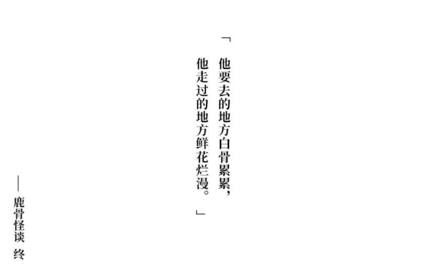
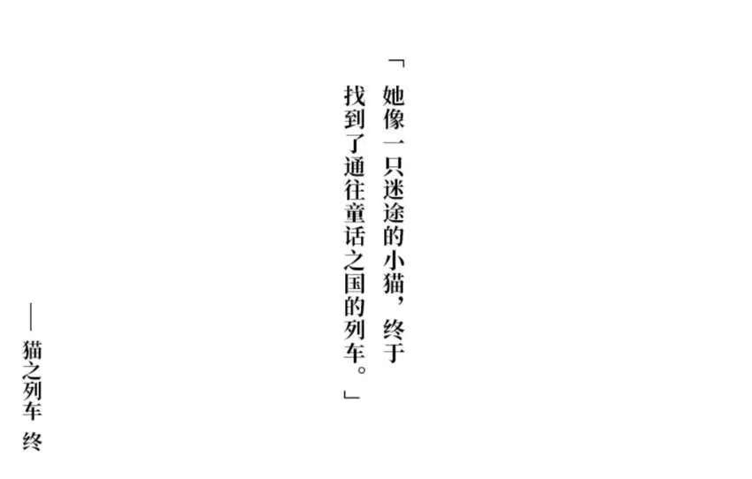
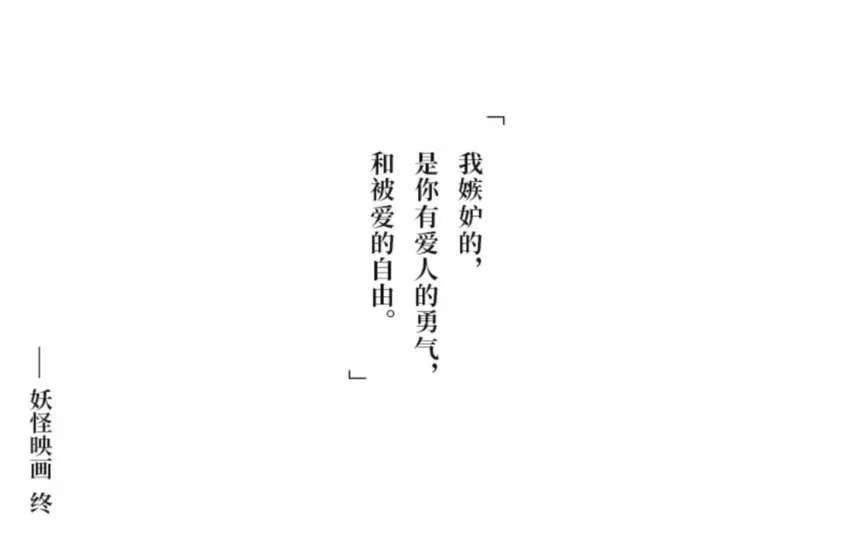

# 2024.12

## 12.12
- 有时候真的会怀疑自己的能力。初中、高中的我太狂傲，总觉得自己非常聪明，学习什么都不在话下，应试成绩也一直名列前茅。高考失利改变了我，让我变得收敛，甚至截然相反，让我变得有些许自卑，总觉得自己没有往日的辉煌。但是我并不想就此放弃，我觉得我值得更好的地方。

- 一直很想自己将所学的知识以笔记的形式分享给别人，但是自己制作笔记的时候对于哪些该省略，哪些该保留还是处理得不是很好，这一点应该多去思考思考。

## 12.13
- 今天是国家公祭日，让我们为同胞们默哀。

- 小时候真是学习的关键期，时间多，烦恼少，可塑性强，可以培养很多兴趣爱好。音乐，美术，体育，语言，甚至对某一理工科的爱好，均可以在小时候培养，并且真的会对以后的人生有帮助。可惜我意识到这一点已经大学了，回不去，而又羡慕有扎实童子功的人。

- 看到一句话，大概意思就是年轻时候学到的东西，可以受用大半辈子，而如果是中年甚至是老年学到的东西，我们从中受益的时间就短得多了，因此学习还是得趁早。我万分同意这个观点。

## 12.15
- 昨天CET6结束，狠狠给自己放了个假。
- 一个周末打完《黑森町绮谭》。希原酱、桐谷酱、玉前酱都好可爱。这部作品真是给我的心灵带来了极大的震撼吧。
{width=30%}{width=30%}{width=30%}
- 只要不断提升自己，路会越走越宽的。加油，不要放弃。

## 12.16
- 我们对大环境无能为力，但我们是可以自己创造小环境的。————钱理群教授
- 不得不说，大环境对人的影响还是太大了。就谈谈束星北教授吧，他在上个世纪真是一个伟大的物理学家，拥有无比聪明的大脑，在现在绝对能为国家做出很大的贡献。无奈的是，他因为不喜欢搞政治那一套，性子又比较直，在最黑暗的十年被打成“右派”，迫不得已进行“改造”，当他回归正常生活时已经无法跟上物理学发展的节奏了。虽然如此，他依旧做出了很大的贡献。我为他的命运感到惋惜。我和他身上也有相似之处，我也反对甚至是厌恶给知识分子扣上一些本不属于他们的政治帽子，我认为这是对纯洁的知识的玷污。
- 最近越来越喜欢读钱理群教授的文章了，从他的文章里能看出他对我们社会问题的反思，尤其是教育方面。钱老是专门研究鲁迅的，我认为他和鲁迅有很多相似之处的，都敢对社会的问题提出自己的见解，并且能够用文字表达出来。作为知识分子，理应用自己的方式为社会的发展做出自己的贡献，即使存在不被大多数人所理解，扣上“反动”帽子的风险。
- 大环境对我的影响就是让我有了这些所思所感，哈哈。
