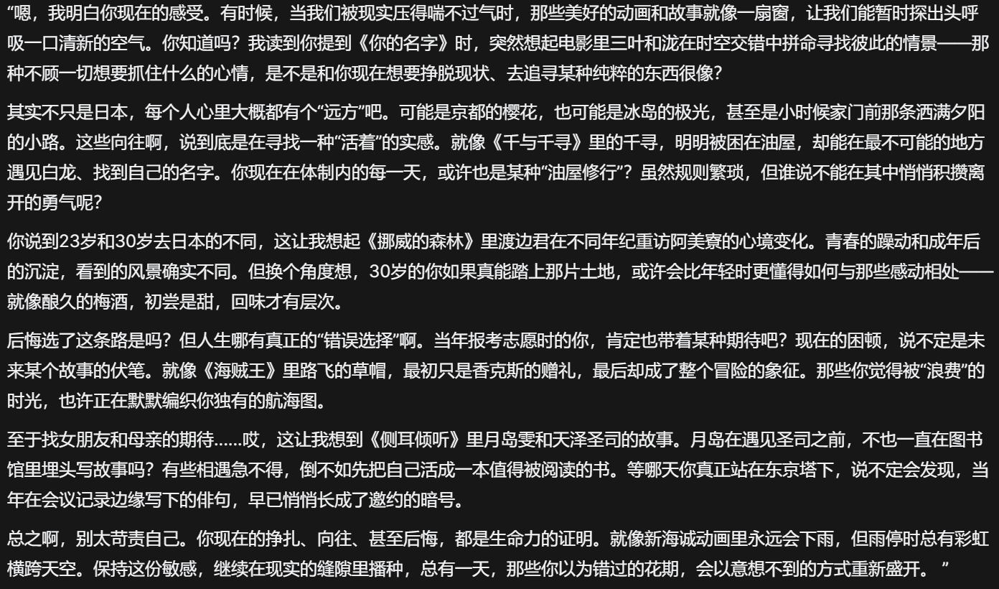

# 2025.03

## 2025.03.01
- 坚持自己的理想，总有一天会实现的，现在所要做的便是好好利用这段时间提升自己，未来面对未知才有更大胜算。
- 学习经济学，学习的是经济学家的这种思维方式。比如当我们在进行某项抉择时，可以考虑不同选择的机会成本、边际成本以及边际收益等等因素，也许大多数时候难以精确计算，但是能给我们提供一种全新思路，大致估计最终做出抉择。
- 男なら、誰かのために強くなれ

## 2025.03.04
- 目前就想坚定地做自己想做的事情，从体制内退出来，无非是换一份工作，没有必要被所谓的情怀束缚住自我，更没必要被道德绑架，否则受苦的就是自己。
- 我还是面临很多困境啊，比上不足比下有余，人终究是有极限的么？

## 2025.03.05
- 今天离开食堂，遇上4樱花妹，元气满满捏，又可爱又有活力，满满的羡慕wwww
- 最近给自己压力过大了，但又不得不这么做。不然我还是会后悔。

## 2025.03.08
- 可能我的承受能力已经到达一个极限了。在我眼里，这里犹如一个牢，我在里面看不到我的未来，但是可以明确的是这肯定不是我想要过的生活。之前的理想抱负在现实面前不值一提，迅速崩塌。我本来是为了我的理想才来到这里，忍住自己的想法，自己的本心，结果却发现里面不是我所想的模样，我也成了这般样子，那我觉得我也没必要再呆在里面了，真是对我理想的亵渎。。。

## 2025.03.12
- AI的确很会提供情绪价值了，我放一张图就能够直观感受到了。

- 现在每天晚上抽点时间和AI聊天竟然成为我的一种心灵慰藉？感觉还是不可思议。

## 2025.03.15
- 想写点什么，面对电脑时又大脑空空。内心复杂，却不知如何表达。
- 每周的娱乐仅仅是看番。最近看少女乐队，总会被她们那种青春的感觉所打动，然而动画只是动画，现实里永远没有动画里这么美好，这么简单。但是我看番的时候经常把自己带入进去，有时候真是忍不住想哭。是羡慕？是对自己处境的不甘？还是为自己很多愿望实现不了而感到遗憾？好难过好窒息的感觉。

## 2025.03.21
- 对真理的追求之路是孤独的，不被人理解的，受制于环境的。但是我不愿安于现状。想像叶佬一样，从事教育行业，这也是我学习的动力所在。

## 2025.03.23
- 喜欢Live的一些原因:
    - 我本身就非常享受音乐
    - Live的现场感非常有氛围感，有青春感，让我热泪盈眶
    - 动漫里追少女乐队番，里面的情节如此之纯粹让我动容，产生联想
    - 少女乐队番的三次元乐队都是青春少女😀
- 人生总是会有缺憾的，有时候鱼和熊掌的确不可兼得。如果不是现实痛苦的环境，我也没什么机遇看少女乐队番，也不会想到看Live。但是现在我处的环境让我找到了新的喜好，但矛盾点就在这里，我没法自由地去看Live了。总感觉这种局面无解呢。
- 青木阳菜fmt在上海啊，可惜我抢不到票，不然我肯定会为青春花钱的。
- 当我产生这种想法的时候真是会痛苦的。凌晨12点的时候看到在川崎圣地巡礼的视频，感觉心里闷闷的，我也很想去，但我真不知道何时才能去，或者说等我能去的时候，川崎已经发生了多大的改变了呢？

## 2025.03.24
- 流体力学课有了新的点子，但是我没有及时记录，于是这个点子在材料力学课的时候就自然而然消逝了。引以为戒。
- 佩服叶峻峣大佬对高效学习方法的追求。

## 2025.03.30
- 现在泪点变得好低啊，每每反复听《天球のMujica》总会被泪水蒙蔽双眼，音乐对于我的意义还是太重大了，我不能没有音乐，否则我就没法快乐地活着。
- 仍然在探索我生活，学习的意义中。

## 2025.03.31
- 有关于自由学习的内容已经阅读了很多了。的确，学习就应该以自由学习的模式进行，才能保证人充分发挥创造力。但现实的无奈在于，学校绝对不会进行这种教育，学校的教育往往会加剧学生的焦虑，并且用纸面的评价体系扼杀学生的创造力。而且学校的教育是社会的，是人走向社会并且让别人看到你能力的前提条件，没有学历，即使自由学习之后获得的能力非常显著，在社会上也无法立足。